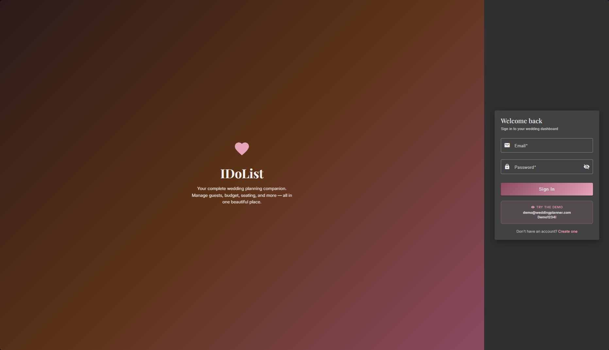
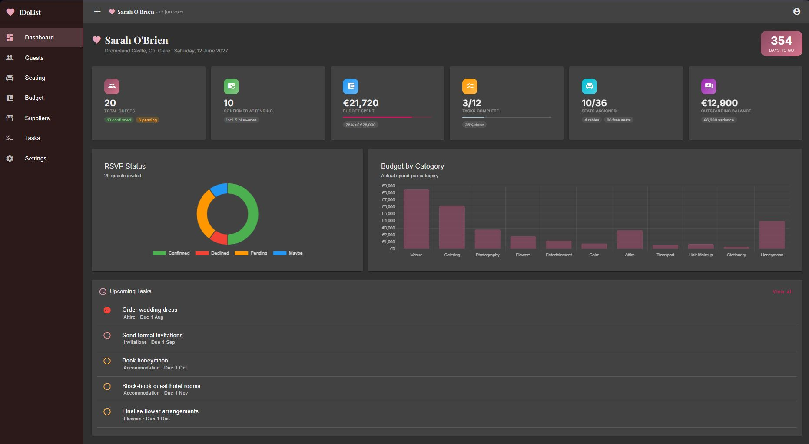
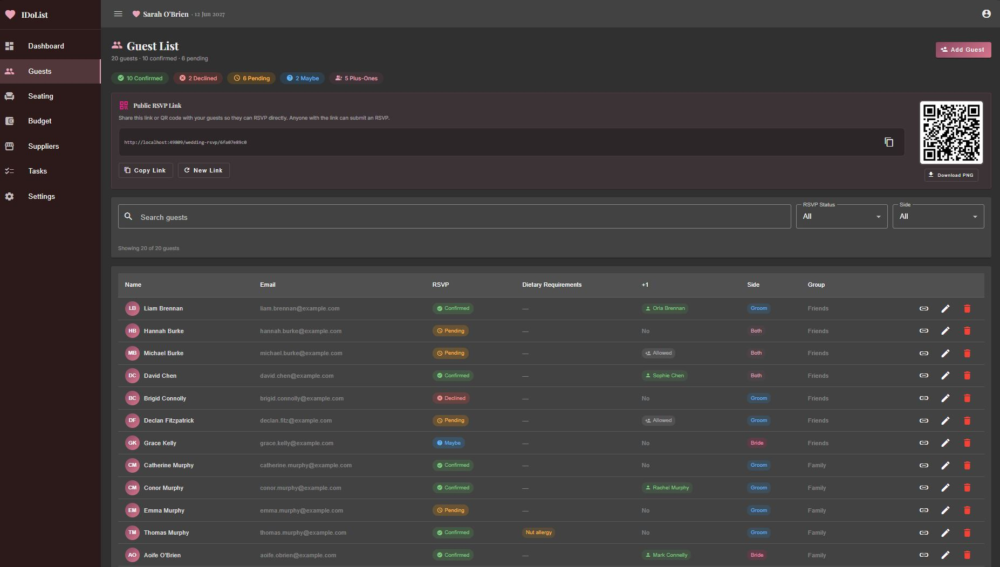
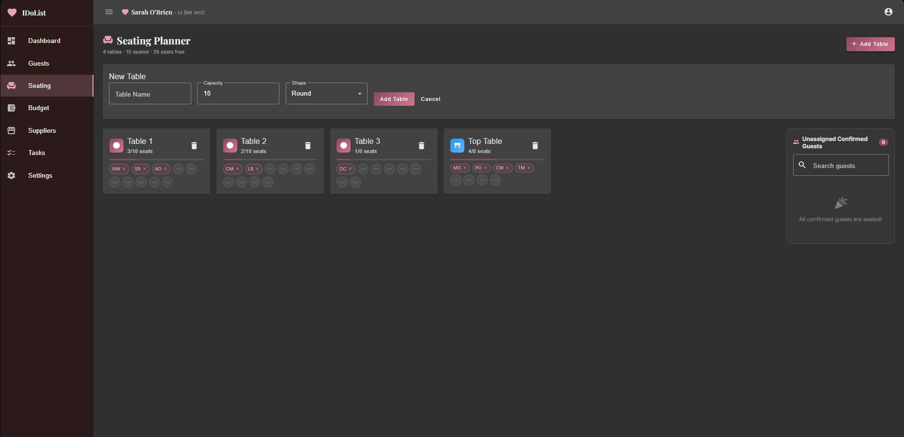
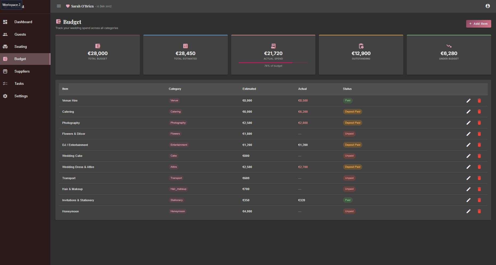
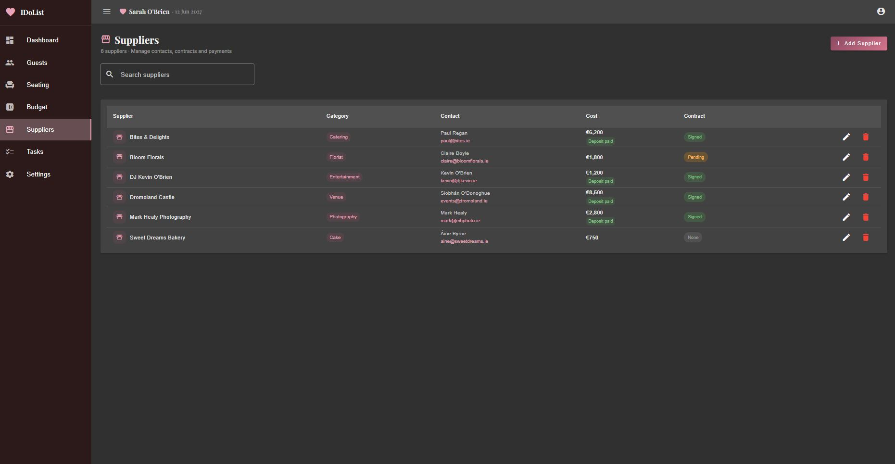
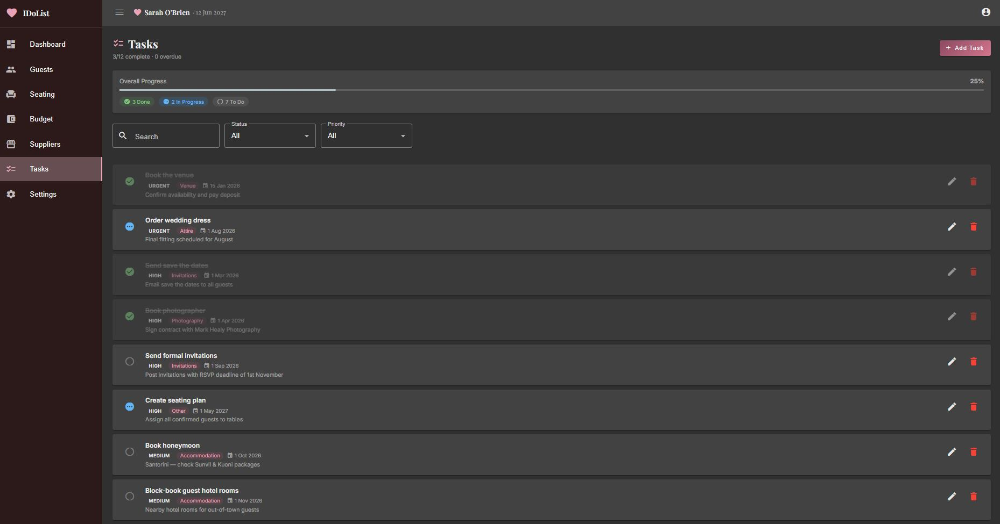
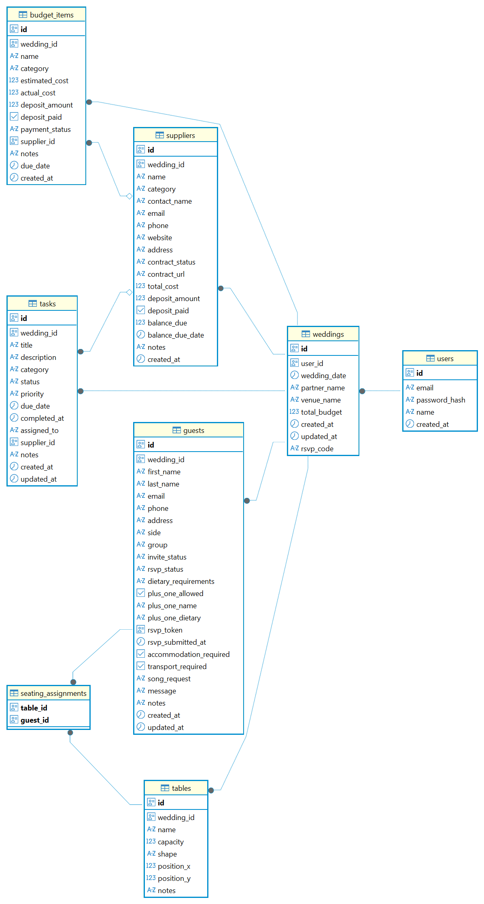

# IDoList — Wedding Planner

A full-stack wedding planning SaaS application. Couples can manage their guest list, seating plan, budget, suppliers, and tasks from a single dashboard. Guests can RSVP via a shareable public link or QR code without needing an account.

---

## Features

- **Dashboard** — live overview of RSVP status, budget spend, task progress, and seating
- **Guest Management** — full guest list with RSVP tracking, dietary requirements, and plus-ones
- **Public RSVP Link** — shareable URL and QR code for guest self-registration; downloadable as PNG
- **Per-guest RSVP** — individual token links for guests to update their own RSVP
- **Seating Planner** — drag-and-assign table management with capacity enforcement
- **Budget Tracker** — itemised budget by category with actual vs estimated cost charts
- **Supplier Manager** — track vendors, contracts, deposits, and balances
- **Task Checklist** — prioritised task list with due dates and status tracking
- **Settings** — wedding date, partner name, venue, and profile management
- **Demo Account** — pre-populated with realistic data for evaluation

---

## Screenshots

### Login


### Dashboard


### Guest List


### Seating Planner


### Budget Tracker


### Suppliers


### Tasks


---

## Database Schema


---

## Tech Stack

| Layer | Technology |
|---|---|
| Frontend | Angular 20, Angular Material, Chart.js |
| Backend | Node.js, Express 4 |
| Database | PostgreSQL (Neon serverless) |
| Auth | JWT, bcryptjs |
| QR Codes | qrcode (client-side, no external service) |
| API Spec | OpenAPI 3.0 |
| Deployment Frontend | Azure Static Web Apps |
| Deployment Backend | Azure App Service |
| DNS | Cloudflare |
| CI/CD | GitHub Actions |

---

## Prerequisites

- Node.js 18+
- npm 9+
- A [Neon](https://neon.tech) PostgreSQL database (or any PostgreSQL 14+ instance)

---

## Getting Started

### 1. Clone and install

```bash
git clone <repo-url>
cd wedding-planner
```

Install backend dependencies:

```bash
cd backend
npm install
```

Install frontend dependencies:

```bash
cd ../frontend
npm install --legacy-peer-deps
```

### 2. Configure the backend

Create `backend/.env` from the example:

```bash
cp backend/.env.example backend/.env
```

Fill in the values:

```env
DATABASE_URL=your_neon_connection_string
JWT_SECRET=a_long_random_secret
PORT=3000
```

### 3. Run database migrations

```bash
cd backend
npm run migrate
```

### 4. (Optional) Seed the demo account

```bash
npm run seed
```

This creates `demo@weddingplanner.com` / `Demo1234!` with a fully populated wedding.

---

## Running Locally

Start the backend (from `backend/`):

```bash
npm run dev
```

Start the frontend (from `frontend/`):

```bash
npm start
```

| Service | URL |
|---|---|
| Frontend | https://wedding-planner.alandineen.dev |
| Backend API | https://api-wedding-planner-cjh9avbdb0hsd4gf.westeurope-01.azurewebsites.net |

---

## Demo Account

| Field | Value |
|---|---|
| Email | demo@weddingplanner.com |
| Password | Demo1234! |
| Couple | Sarah O'Brien & James Murphy |
| Date | 12 June 2027 |
| Venue | Dromoland Castle, Co. Clare |
| Budget | €28,000 |

---

## Project Structure

```
wedding-planner/
├── backend/
│   ├── src/
│   │   ├── db/
│   │   │   ├── migrations/     # SQL migration files (run in order)
│   │   │   ├── client.js       # pg connection pool
│   │   │   ├── helpers.js      # row mappers, asyncHandler
│   │   │   ├── migrate.js      # migration runner
│   │   │   └── seed.js         # demo data seeder
│   │   ├── middleware/
│   │   │   ├── auth.js         # JWT verification
│   │   │   └── errorHandler.js
│   │   ├── routes/
│   │   │   ├── auth.js
│   │   │   ├── budget.js
│   │   │   ├── dashboard.js
│   │   │   ├── guests.js
│   │   │   ├── rsvp.js         # per-guest token RSVP
│   │   │   ├── suppliers.js
│   │   │   ├── tables.js
│   │   │   ├── tasks.js
│   │   │   └── weddingRsvp.js  # public shareable RSVP link
│   │   ├── app.js
│   │   └── index.js
│   ├── .env.example
│   └── package.json
│
├── frontend/
│   └── src/
│       └── app/
│           ├── core/
│           │   ├── auth/           # AuthService, JWT interceptor, guard
│           │   └── services/       # GuestService, BudgetService, etc.
│           ├── features/
│           │   ├── dashboard/
│           │   ├── guests/
│           │   ├── seating/
│           │   ├── budget/
│           │   ├── suppliers/
│           │   ├── tasks/
│           │   ├── settings/
│           │   ├── rsvp/           # per-guest RSVP page (public)
│           │   ├── wedding-rsvp/   # shareable link RSVP page (public)
│           │   ├── auth/           # login, register
│           │   └── landing/
│           ├── layout/             # app shell, nav sidebar
│           └── shared/             # models, pipes
│
└── documentation/
    ├── architecture.md
    ├── openapi.yaml        # full API spec (OpenAPI 3.0)
    └── erd-wedding-planner.png
```

---

## API Reference

The full API is documented in [`documentation/openapi.yaml`](documentation/openapi.yaml).

**Base URL:** `http://localhost:3000/api`

All authenticated endpoints require a `Bearer <token>` header. Tokens are issued on login and registration and expire after 7 days.

Public endpoints (no auth required):

| Method | Path | Description |
|---|---|---|
| POST | `/auth/register` | Register a new account |
| POST | `/auth/login` | Login |
| GET | `/rsvp/:token` | Load a per-guest RSVP form |
| POST | `/rsvp/:token` | Submit a per-guest RSVP |
| GET | `/wedding-rsvp/:code` | Load the public RSVP form |
| POST | `/wedding-rsvp/:code` | Self-register as a guest via the public link |

---

## Public RSVP Link

Each wedding has a unique shareable RSVP code. The couple can find their link and QR code in the **Guests** section of the app. Guests who submit via the public link are added directly to the guest list.

The code can be regenerated at any time — the old link stops working immediately.

---

## Building for Production

```bash
cd frontend
npm run build
```

Output goes to `frontend/dist/wedding-planner/`.

For the backend, set `NODE_ENV=production` and ensure `DATABASE_URL` and `JWT_SECRET` are set in your hosting environment.
